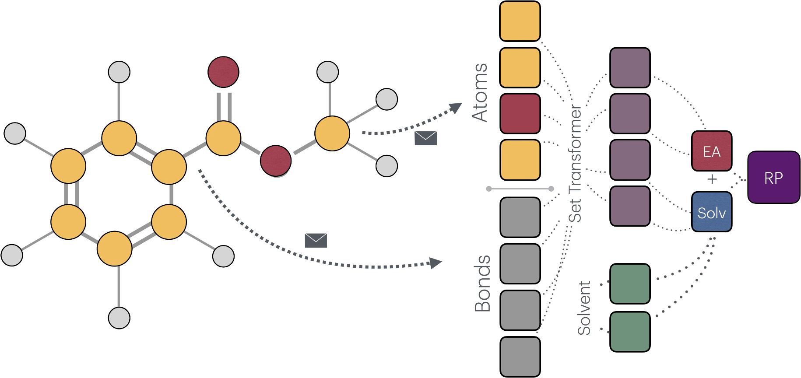

# ReSolved - Multi-Solvent Reduction Potetnail Estimation GNN

This repository contains code for predicting the reduction potentials of molecular species in various solvents. This approach enables simultaneous learning of electron affinity and solvent-dependent corrections for redox potentials and can generalise to RP outisde of the dataset.

---

## Table of Contents
1. [Usage](#usage)
2. [Methods](#methods)
    1. [Haber Thermodynamic Cycle for Reduction Potential](#haber-thermodynamic-cycle-for-reduction-potential)
    2. [MPNN Architecture](#mpnn-architecture)
    3. [Set Transformer Readout and Solvent Embedding](#set-transformer-readout-and-solvent-embedding)
3. [Repository Structure](#repository-structure)
4. [Training and Evaluation](#training-and-evaluation)


---


## Usage

This implementation supports 2 mods of training, truing on/off conditioning the training on the -EA. This can be set up in `run_experiment.py` or `train.py`, by setting the `explicit_ea = False`

### Data Preparation

Place your CSV file (e.g., `resolved.csv`) in the project folder. It should contain columns for:
- `smiles` (string)
- `EA` (float)
- `RP_ACN`, `RP_H2O`, `RP_THF`, `RP_DMSO`, `RP_DMF` (float) — these are solvent-dependent properties.

### Running the Experiment

1. Modify hyperparameters in `run_experiment.py` or `train.py` if desired (e.g., `num_layers`, `emb_dim`, `epochs`).
2. Run:
   ```bash
   python run_experiment.py
   ```


### Outputs
- `best_model.pth`: the best-scoring model checkpoint.
- `loss_curve.png`: training vs. validation loss plot.
- Scatter plots of predicted vs. reference values for each solvent.
- CSV files (e.g., `train_data.csv`, `test_data.csv`) with ground-truth and predicted values.

### Evaluating trained model

1. Provide the path to the weigths in eval_trained.py or use the provided weigths in /weights.
2. Run:
   ```bash
   python eval_trained.py
   ```

---

## Methods

### Haber Thermodynamic Cycle for Reduction Potential

We estimate the solution-phase free energy change for the reduction:

$$
A + e^- \rightarrow A^-
$$

using a thermodynamic cycle:

$$
\Delta G_{\text{solution}} = \Delta G_{\text{gas}} + \Delta G_{\text{solv},A^-} - \Delta G_{\text{solv},A}
$$

Here:
- $\Delta G_{\text{solution}}$ is the gas-phase electron attachment free energy.
- $\Delta G_{\text{solv},A}$ and  $\Delta G_{\text{solv},A^-}$  are the solvation free energies for neutral $\ A$ and anionic $\ A^-$, respectively. 

---

### Electrode Potential

The electrode potential $\ E$ relates to the Gibbs free energy change via:

$$
\Delta G = -nFE 
\quad \text{and} \quad
E_{\text{red}} = E^\circ - \frac{\Delta G}{nF},
$$

where $\ n$ is the number of electrons transferred and $\ F$ is the Faraday constant.



### MPNN Architecture

In this codebase, node (atom) and edge (bond) features are updated using multiple rounds of message passing. Each MPNN layer:

1. Computes messages from neighboring nodes and edges.
2. Produces updated node features, which we combine residually with the previous layer’s node features.
3. Similarly updates the edge states in a residual fashion.

After the final layer, we concatenate the final node and edge embeddings.

### Set Transformer Readout and Solvent Embedding

We pass the concatenated node-edge feature set through two parallel Set Transformer aggregations:

1. One dedicated to predicting electron affinity (EA).
2. Another to incorporate solvent information (via learnable embeddings of each solvent’s dielectric constant and refractive index) and generate the solvent-dependent correction.

By concatenating these aggregated representations with the solvent embeddings, the model predicts:
- The negative of the EA (i.e., -EA.
- The combined \(-EA + $\text{(solvent contribution)}\ $) for each solvent.

Thus, each forward pass yields a multi-output prediction vector:

$$\ [-EA, -EA + \Delta_{solv} ]  $$

---

## Repository Structure

```
resolved_project/
├── data_utils.py      # Reading CSV, dataset creation, SMILES->PyG conversion
├── features.py        # RDKit-based atom and bond feature extraction
├── model/
│   ├── mpnn_layer.py  # Custom MPNN layer (MessagePassing in PyG)
│   ├── readout.py     # Set Transformer-based readout + solvent embeddings
│   └── mpnn_model.py  # Full model combining MPNN layers + readout
├── train.py           # Setting up the model & hyperparameters, evalauting the training
├── train_loop.py      # Main training loop
├── evaluate.py        # Evaluation loop, metrics and plotting tools
├── eval_trained.py    # Loading the weights, evaluating and plotting 
└── run_experiment.py  # Script orchestrating data loading, training, and evaluation


